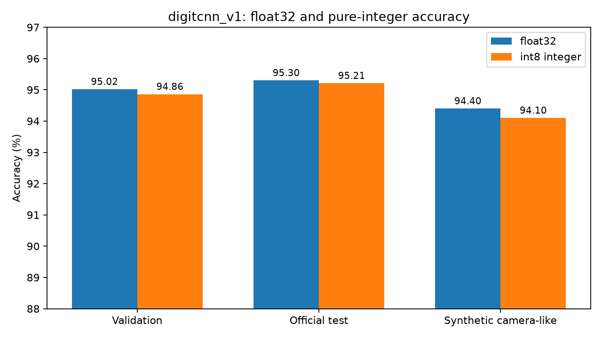

# 手写数字 CNN 第一版交接入口

版本：`digitcnn_v1_int8`。B 已完成训练、图片预处理、整数化和软件验证。**MNIST 测试准确率 95.21%；尚未完成 FPGA 实现或 OV5640 实拍验证。**

| 你负责什么 | 从这里开始 | 本次拿到什么 |
|---|---|---|
| A：硬件与系统集成 | [A 的接手步骤](docs/FOR_A.md) | int8 权重、int32 偏置、逐层整数答案、数值规则及 AXI 草案 |
| C：Notebook 与联调 | [C 的接手步骤](docs/FOR_C.md) | 无 PyTorch 的预处理、整数参考、可运行示例和 Notebook |
| B：模型与算法 | [复现与来源](docs/REPRODUCIBILITY.md) | 训练脚本、checkpoint、数据划分、评估和量化源代码 |
| 全员 | [版本与接口状态](docs/STATUS.md) | 已完成项、待协商项、验收顺序 |

## 五分钟检查

电脑建议 Python 3.10～3.12。从本目录执行（首次安装依赖需要网络）：

```powershell
python -m venv .venv
.\.venv\Scripts\python.exe -m pip install -r requirements.txt
.\.venv\Scripts\python.exe verify_package.py
.\.venv\Scripts\python.exe verify_release.py
.\.venv\Scripts\python.exe verify_packaging.py
.\.venv\Scripts\python.exe demo.py
```

Linux/PYNQ 对应使用 `.venv/bin/python` 或板上已有的 `python3`。板上 Python、NumPy、Pillow 版本尚待确认；不要直接套用电脑训练环境的锁定文件升级板上系统。

打开交接 Notebook：

```powershell
.\.venv\Scripts\python.exe -m pip install -r requirements-notebook.txt
.\.venv\Scripts\python.exe -m jupyterlab demo.ipynb
```

`verify_release.py` 应报告 `verification_passed: true`；`demo.py` 应输出固定样本 `[0,1,2,3,4,5,6,7,8,9]`。Notebook 也可在 GitHub 上预览。

## 结果

| 数据 | float32 | 整数模型 | 差值 |
|---|---:|---:|---:|
| 验证集 5000 张 | 95.02% | 94.86% | -0.16 个百分点 |
| 官方测试集 10000 张 | 95.30% | 95.21% | -0.09 个百分点 |
| 合成拍照图 1000 张 | 94.40% | 94.10% | -0.30 个百分点 |



模型结构：`Conv(1→4,3×3) → ReLU → MaxPool(2×2) → Flatten(676) → Linear(10)`。参数总数 6810，整数参数原始数据共 6852 字节。资源利用率、频率、帧率和功耗需要板上测量。

## 文件导航

- [release/parameters/](release/parameters/)：NPY/NPZ、Verilog MEM、无头 BIN 三种参数。
- [release/reference/](release/reference/)：固定 0～9 输入及逐层整数结果。
- [release/evaluation/](release/evaluation/)：准确率、混淆矩阵、错误变化、完整预测记录。
- [preprocess.py](preprocess.py)：图片 → uint8[28,28]；只依赖 NumPy/Pillow。
- [integer_inference.py](integer_inference.py)：uint8 图片 → 十个 int32 分数的 CPU 标准答案。
- [demo.ipynb](demo.ipynb)：逐格查看示例。
- [reproduction/](reproduction/)：保留原始训练、量化过程和 checkpoint；不含数据集或虚拟环境。

可以直接浏览以上文件，也可在 [downloads/](../../downloads/) 下载包含本目录全部文件的 ZIP。压缩包与散装目录使用同一份 SHA-256 文件清单。硬件接口变更请记录新版本，不覆盖本版参考值。
